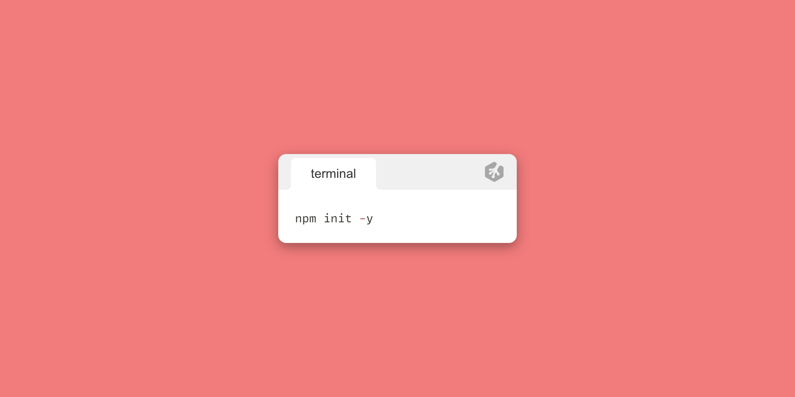
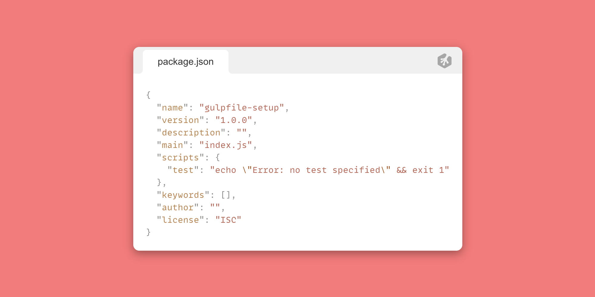
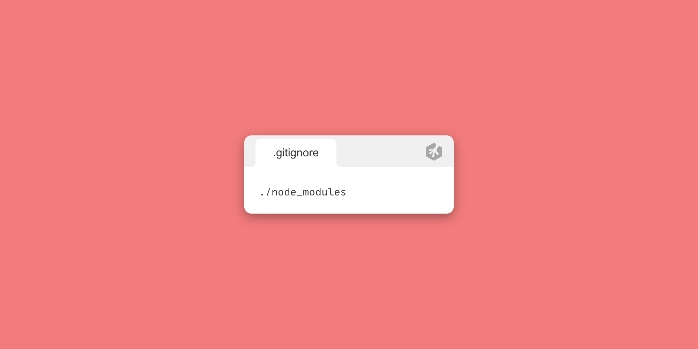
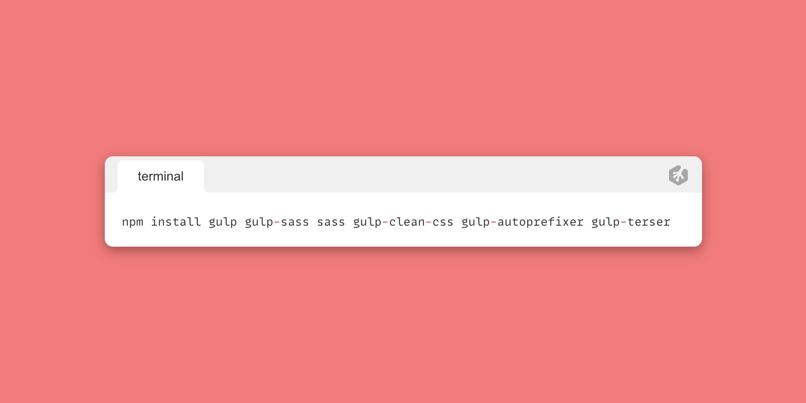
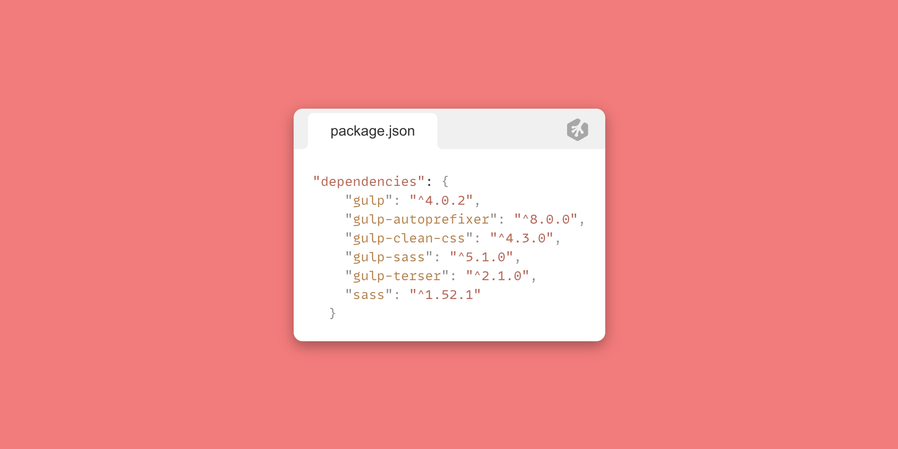
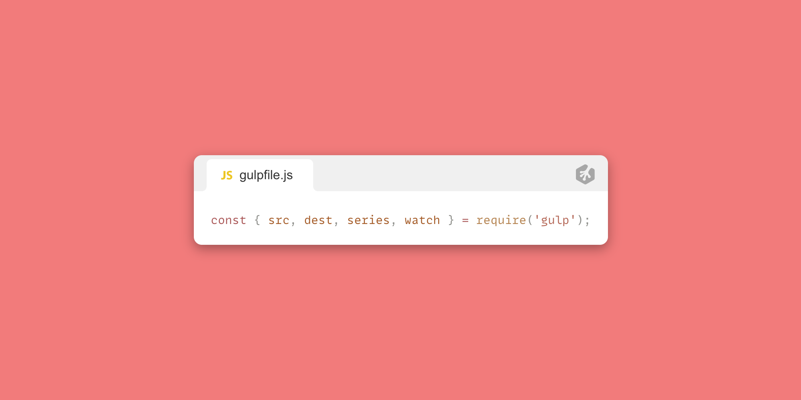

[Treehouse](https://teamtreehouse.com) - [Blog](https://teamtreehouse.com/blog) - [Twitter](https://twitter.com/treehouse) - [Youtube](https://www.youtube.com/gotreehouse) - [Instagram](https://www.instagram.com/teamtreehouse/) - [Linkedin](https://www.linkedin.com/school/treehouse-island-inc-/)

# 
Gulpfile Setup using gulp.js

## **Introduction to gulp.js**

What is gulp? According to their homepage ([gulpjs.com](https://www.gulpjs.com)), it's _a toolkit to automate & enhance your workflow._ What exactly does that mean? Well, for medium to large sized projects you may want to have a folder with all your styles and scripts minified. This can significantly decrease file sizes and is usually best practice when deploying your app. Gulp can do all the hard work for you. It can throw all your final code into a new folder, minify it, even adding extra things to your make your code even better!

I'm going to take you through setting up a basic gulpfile for your own projects and apps. Once we're done, you should have a clear understanding of how gulp works as well as adding even more features to making your gulpfile even more powerful. Let's get started!

 
 

## Prerequisites

To get the most out of this content, it is advised you have a decent understanding of JavaScript as well as a basic understanding of Node.js and npm. If those topics aren't familiar to you or need a refresher, I've provided some links to Treehouse resources blow 👇🏼

1. [JavaScript Basics](https://teamtreehouse.com/library/javascript-basics)
2. [Node.js Basics](https://teamtreehouse.com/library/nodejs-basics-3)
3. [npm Basics](https://teamtreehouse.com/library/npm-basics-2)

 
 

## Getting Started

I encourage you to read through this README.md file and follow along in your own text editor. If you get stuck, you can take a look at the code in this repository. Ready? Let's go! 🚀

 
 

## Initializing the project

 

On your desktop (or wherever you'd like to store your project), create a new folder. Let's call it `gulpfile-setup`. Once done, open it up in your text editor. Next we'll need to open up the terminal. Make sure you're inside your new project folder. To get things started, we'll need a `package.json` file. We can set that up pretty easily by running `npm init -y`

 

 

You'll notice a `package.json` file is automatically generated for you. Don't worry about it's contents as that isn't too important for this guide. It should look pretty similar to this:

 

 

Next, we'll need to install some packages for gulp via npm. This will create a **_node_modules_** folder inside our project folder. Generally, this folder will have lots of packages inside and is usually not a good idea to be tracked with git. So let's first create a `.gitignore` file inside our project.Once created, we can ignore our node modules folder by writing `./node_modules`

 

⭐ Pro tip: You may or may not be using git to track this project but it's always good practice to ignore your node modules folder.

 
 

Next, we'll want to install the npm packages we'll need to work with gulp. For this basic gulp setup, we'll be installing a package to compile our css to scss, add auto-prefixers to our compiled css, minify our css, and minify our javascrip. So here are the packages we'll be installing. I'll link the individual packages to their documentation on the gulp.js website:

 

1. [gulp](https://www.npmjs.com/package/gulp)
2. [gulp-sass](https://www.npmjs.com/package/gulp-sass)
3. [sass](https://www.npmjs.com/package/sass)
4. [gulp-clean-css](https://www.npmjs.com/package/gulp-clean-css) (minifies our css)
5. [gulp-autoprefixer](https://www.npmjs.com/package/gulp-autoprefixer) (adds auto-prefixers to our css)
6. [gulp-terser](https://www.npmjs.com/package/gulp-terser) (minifies our javascript)

 
 

You can install npm packages by running `npm install {package name}` To install them, in your terminal, make sure you're in your project's root directory. Then write the following:

`npm install gulp gulp-sass sass gulp-clean-css gulp-autoprefixer gulp-terser`

 
 

 
 

Be sure to check your terminal's output message to see if all the packages have been installed successfully. Additionaly, you can check your project's **_package.json_** file under **_dependencies_**:

 
 

 

> Don't worry if your package's versions are different from what you see above vs your package.json file.

 
 

Now that we have all the packages we need, let's setup our gulpfile. 😎

 

We can start by creating a new file in our project's directory: `gulpfile.js`
We will need to use some of the APIs that we have access to from our **_gulp_** package. We can create variables for them.

 

`const { src, dest, series, watch } = require('gulp');`

 

 

Basically what we're doing here is destructuring these APIs from the gulp package into variables; `src`, `dest`, `series`, & `watch`.

Let's go over these briefly before we use them:

`src API`:
[https://gulpjs.com/docs/en/api/src](https://gulpjs.com/docs/en/api/src/)

Reading the above documentation may confuse you but basically what this does is gives us a way to give our gulpfile a source (src) directory/file to listen and check for changes. This will be clearer when we get into writing out the rest of our gulpfile.

`dest API`:
[https://gulpjs.com/docs/en/api/dest](https://gulpjs.com/docs/en/api/dest)

This is much like the src API but instead of giving it a source directory or file, we give it a destination directory. Basically, when we access files from source and make our changes, where do we want to put it? That's when we choose a destination. Makes sense?

`series API`:
[https://gulpjs.com/docs/en/api/series](https://gulpjs.com/docs/en/api/series)

The series API is an easy one. From gulp's documentation: **_Combines task functions and/or composed operations into larger operations that will be executed one after another, in sequential order._** Which basically means we run a series of functions one after another as parameters. For example: `series(func1, func2, func3)`

`watch API`:
[https://gulpjs.com/docs/en/api/src](https://gulpjs.com/docs/en/api/src/)

The watch API is another easy one. This one takes two parameters. The files/folder you want to watch for changes and then a task you want to run when those changes happen. Let's get started writing our gulpfile so we can see this in action.

Now that we can access our APIs from **gulp**, let's grab our npm packages we installed and assign them to variables.

 

Side note:

To make this easier to understand and organized, I will keep all the packages associated with the styles for our project separate from the packages for our scripts.

These variables will act as methods (functions) for our packages. If this doesn't make sense to you, no worries! I will explain this as we go.

Also, you can name these variables anything you want. What I name them is just how I prefer to name them.

 
 

`const scss = require('gulp-sass')(require('sass'))`

You can name this variable anything you'd like. I chose to name is `scss` becasue it will handle compiling our scss code to css for us. This
