

[Treehouse](https://teamtreehouse.com) - [Blog](https://teamtreehouse.com/blog) - [Twitter](https://twitter.com/treehouse) - [Youtube](https://www.youtube.com/gotreehouse) - [Instagram](https://www.instagram.com/teamtreehouse/) - [Linkedin](https://www.linkedin.com/school/treehouse-island-inc-/)

# 
Gulpfile Setup using gulp.js

## **Introduction to gulp.js**

What is gulp? According to their homepage ([gulpjs.com](https://www.gulpjs.com)), it's _a toolkit to automate & enhance your workflow._ What exactly does that mean? Well, for medium to large-sized projects you may want to have a folder with all your styles and scripts minified. This can significantly decrease file sizes and is usually best practice when deploying your app. Gulp can do all the hard work for you. It can throw all your final code into a new folder, minify it, and even add extra things to make your code even better!

I'm going to take you through setting up a basic gulpfile for your own projects and apps. Once we're done, you should have a clear understanding of how gulp works as well as add even more features to make your gulpfile even more powerful. Let's get started!

 
 

## Prerequisites

To get the most out of this content, it is advised you have a decent understanding of JavaScript as well as a basic understanding of Node.js and npm. If those topics aren't familiar to you or you need a refresher, I've provided some links to Treehouse resources below. 👇🏼

1. [JavaScript Basics](https://teamtreehouse.com/library/javascript-basics)
2. [Node.js Basics](https://teamtreehouse.com/library/nodejs-basics-3)
3. [npm Basics](https://teamtreehouse.com/library/npm-basics-2)

 
 

## Getting Started

I encourage you to read through this README.md file and follow along in your own text editor. If you get stuck, you can take a look at the final code in this repository. Ready? Let's go! 🚀

 
 

## Initializing the project

 

On your desktop (or wherever you'd like to store your project), create a new folder. Let's call it **gulpfile-setup**. Once created, open it up in your text editor. Next we'll need to open up the terminal. Make sure you're inside your new project's folder. To get things started, we'll need a `package.json` file. We can set that up pretty easily by running `npm init -y` in the terminal.

 

 

You'll notice a `package.json` file is automatically generated for you. Don't worry about it's contents as that isn't too important for this guide. It should look pretty similar to this:

 

 

Next, we'll need to install some packages for gulp via npm. This will create a **node_modules** folder inside our project folder. Generally, this folder will have lots of packages inside and is usually not a good idea to be tracked with git. So let's first create a `.gitignore` file inside our project.Once created, we can ignore our node modules folder by writing `./node_modules`

 

⭐ Pro tip: You may or may not be using git to track this project but it's always good practice to ignore your node modules folder.

 
 

Next, let's install the npm packages we'll need to work with gulp. For this basic gulp setup, we'll be installing a package to compile our css to scss, add auto-prefixers to our compiled css, minify our css, and minify our javascript. So here are the packages we'll be installing. I'll link the individual packages to their documentation on the gulp.js website:

 

1. [gulp](https://www.npmjs.com/package/gulp)
2. [gulp-sass](https://www.npmjs.com/package/gulp-sass)
3. [sass](https://www.npmjs.com/package/sass)
4. [gulp-clean-css](https://www.npmjs.com/package/gulp-clean-css) (minifies our css)
5. [gulp-autoprefixer](https://www.npmjs.com/package/gulp-autoprefixer) (adds auto-prefixers to our css)
6. [gulp-terser](https://www.npmjs.com/package/gulp-terser) (minifies our javascript)

 
 

You can install npm packages by running `npm install {package name}`. To install them, in your terminal, make sure you're in your project's root directory. Then type the following:

`npm install gulp gulp-sass sass gulp-clean-css gulp-autoprefixer gulp-terser`

 
 

 
 

Be sure to check your terminal's output message to see if all the packages have been installed successfully. Additionally, you can check your project's **package.json** file under **dependencies**:

 
 

 

> Don't worry if your package's versions are different from what you see above.

 
 

Now that we have all the packages we need, let's setup our gulpfile. 😎

 

We can start by creating a new file in our project's root directory: **gulpfile.js**.
We will need to use some of the APIs that we have access to from **gulp**. We can create variables for them.

 

`const { src, dest, series, watch } = require('gulp');`

 

 

Basically what we're doing here is destructuring these APIs from the gulp package into variables; `src`, `dest`, `series`, & `watch`.

Let's go over these briefly before we use them:

`src API`:
[https://gulpjs.com/docs/en/api/src](https://gulpjs.com/docs/en/api/src/)

Reading the above documentation may confuse you but basically what this does is gives us a way to give our gulpfile a source (src) directory/file to listen and check for changes. This will be clearer when we get into writing out the rest of our gulpfile.

`dest API`:
[https://gulpjs.com/docs/en/api/dest](https://gulpjs.com/docs/en/api/dest)

This is much like the src API but instead of giving it a source directory or file, we give it a destination directory. Basically, when we access files from source and make our changes, where do we want to put it after? That's when we choose a destination. Makes sense?

`series API`:
[https://gulpjs.com/docs/en/api/series](https://gulpjs.com/docs/en/api/series)

The series API is an easy one. From gulp's documentation: **_Combines task functions and/or composed operations into larger operations that will be executed one after another, in sequential order._** Which basically means we run a series of functions one after another as parameters. For example: `series(func1, func2, func3)`

`watch API`:
[https://gulpjs.com/docs/en/api/src](https://gulpjs.com/docs/en/api/src/)

The watch API is another easy one. This one takes two parameters. The files/folder you want to watch changes for and then a task you want to run when those changes happen. Let's get started writing our gulpfile so we can see this in action.

Now that we can access our APIs from **gulp**, let's grab our npm packages we installed and assign them to variables.

 

Side note:

To make this easier to understand and organized, I will keep all the packages associated with the styles for our project separate from the packages for our scripts.

These variables will act as methods (functions) for our packages. If this doesn't make sense to you, no worries! I will explain this as we go.

 

Also, you can name these variables anything you want. What I name them is just how I prefer to name them.

 

`const scss = require('gulp-sass')(require('sass'));`

This is our **gulp-sass** package that also requires the **sass** package to work. This will compile our scss code into css for us.

 

`const autoPrefixer = require('gulp-autoprefixer');`

This is the **autoprefixer** package that will add prefixers to our compiled css.

 

`const cssMinify = require('gulp-clean-css');`

The **clean-css** package will minify our compiled css.

 
 

For our JavaScript, we'll just be minifying it.

`const jsMinify = require('gulp-terser');`

 
 

If everything was written correctly, your **gulpfile.js** should resemble this:

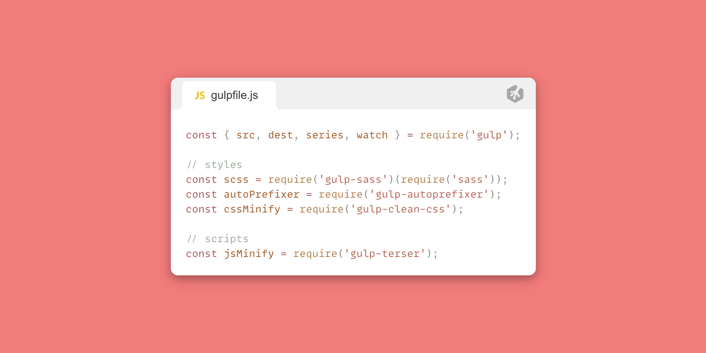

 
 

Great! Now let's start using everything. We will want to setup functions for our styles and scripts. This is how I've laid out my code:

 

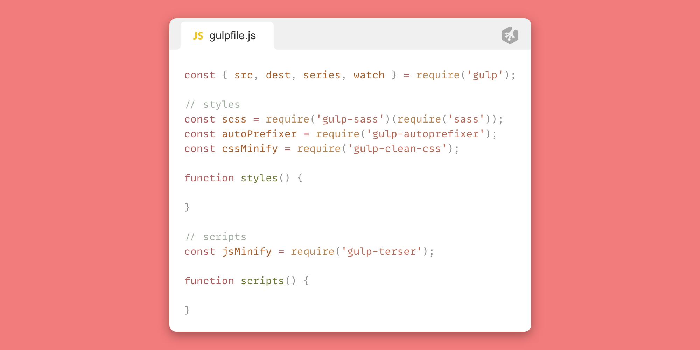

 

The next step would be to give these functions a source directory/file, utilize our gulp methods, and then drop them in a destination directory. For this part, I recommend you set your folder structure up just as I have to make things easier. You can adjust this to your liking once you're more comfortable working with your gulpfile. Here is my directory structure:

 

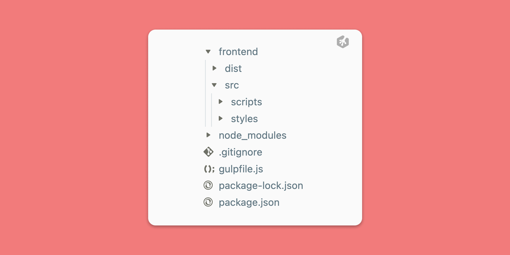

You can see in my project's root directory I have the following:

1. frontend (folder)
2. node_modules (folder)
3. .gitignore (file)
4. gulpfile.js (file)
5. package-lock.json (file) (this is auto-generated)
6. package.json (file)

Inside my **frontend** folder I have two more folders:

1. dist
2. src

(these are just what I decided to call them. You can name these anything but this is a very common naming convention).

 

Let's talk about these two folders. **src** will be where we work out of. This will have all of our scripts, styles, images, etc. When we need to write any styles or scripts, this is the folder we do it in. This will be what we link in our gulp's **src** method soon. **dist** will be where we have gulp send our files once we add things like our compiled css, prefixers and minified versions of our code. We will use our gulp's **dest** method for this. This may seem confusing right now but it will make sense shortly.

Let's start writing in our `styles()` function.

 
 

Basically, what we want from this function is to look for any of our scss partials, compile it to css, add prefixers, minify it, then throw it into our **dist**\_\*\* folder. So let's get started!

 

These functions will only do one main thing. **_Return_** our finished product. So immediately inside the function we will write a return statement. What it will return is our source directory/file and then we'll want to chain on everything else (our gulp API methods and our destination directory). That will look something like this:

`return src('./frontend/src/styles/')`

For scss we will want to watch for all folders as well as files that end in `.scss` right? So what we can do is add `**/*.scss` after the path to our src's styles folder.

`return src('./frontend/src/styles/**/*.scss')`

`**` tells gulp to include any folder in this directory (styles/) and `*.scss` tells it to grab any file in any of those folders with the `.scss` extension.

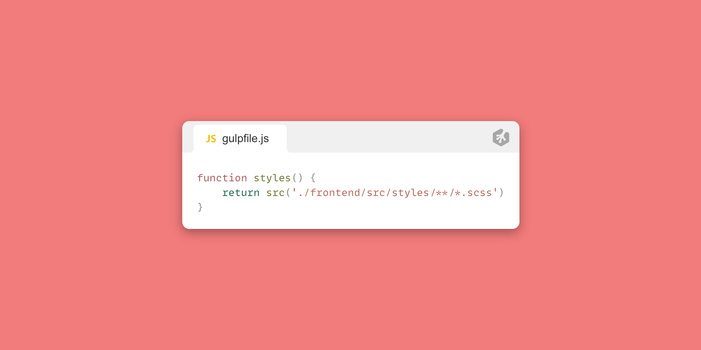

 

Now we'll want to start chaining our methods to this return statement so make sure not to include a `;` at the end of what we've written so far.

To chain on another method we can use `.pipe()`;

 
 

Next, we will want to chain on our scss compiler. Remember we set up a variable named **scss** earlier? I mentioned that those variables will be methods (functions) for our gulp packages. So when we need to use it, the standard `method()` syntax is required. So chaining on our **scss** method would look something like this:

`.pipe(scss())`

We basically put the **scss** method inside the **pipe** method. So now let's add in our other methods.

`.pipe(scss())`

`.pipe(autoPrefixer())`

`.pipe(cssMinify())`

> You will need to add 'last 2 versions' (as a string) to the `autoPrefixer()` method as a parameter. `autoPrefixer('last 2 versions')`

 

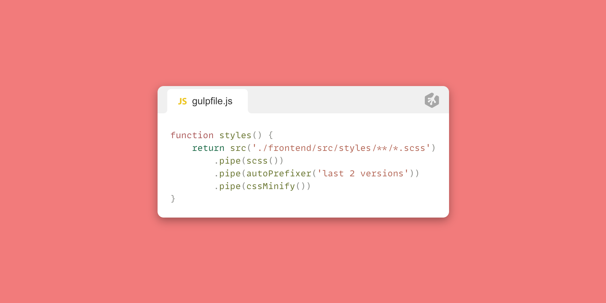

 

Now all that's left to do is add our `dest()` method and give it the path to our **dist** folder.

`.pipe(dest('./frontend/dist/styles/))`

> Even though we didn't create a **_styles_** folder inside our dist folder, it will create it for us.

Your final code for the **styles** function should look like this:

 
 
 

## ⭐ Give it a try - Try setting up the scripts file on your own! ⭐

 

Why not take a stab at the **scripts** function? This should be very straight-forward if you were able to follow along thus far. Give it a shot! in... **3...2...1.. GO!**

 
 

How did you do? Were you able to figure it out on your own? Awesome!! Great work! If not, no worries! We'll go over how to set it up. It's really pretty simple. Just like with our **styles** function, we need to give it a source and destination and chain our methods in-between. In this case, our only method is the `jsMinify`.

Your **source** should look like this:

`return src('./frontend/src/scripts/**/*.js')`

Then we chain our minifyer method:

`.pipe(jsMinify())`

Then we chain on our **destination**:

`.pipe(dest('./frontend/dist/scripts/'))`;

 

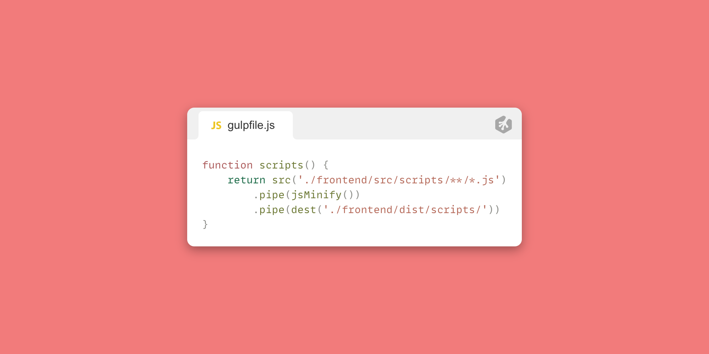

 
 

Great! Now we have our functions set up. Just like you're probably already used to, functions actually don't do anything unless we call them, right? We'll want to call these two functions in a couple of ways. Once initially when the gulpfile is ran and then again each time a change is detected. To do the latter, we'll need to set up a watch task using the **watch** method that we imported from from gulp on the first line of our **gulpfile.js** code. Let's get started.

 
 

Let's set up a new function and name is `watchTask`.

This function will do one thing, call our **watch** method we imported from gulp.

`function watchTask( watch(); );`

The **watch** method takes two parameters. The first is where we would like to watch for changes. In this case we want to watch for changes in **_both_** our styles and scripts folder. So our first parameter can be an array pointer to those locations.

`watch([ './frontend/src/styles/**/*.scss', './frontend/src/scripts/**/*.js' ])`

our next parameter is what we want to do when our **watch** method detects a chance. We'll want to call our functions, right? So let's call them. We'll need to run a series of functions. (**styles** and **scripts**). So now we'll use the **series** method we imported from gulp. That will look like this:

`series(styles, scripts)`

Pretty simple, right? Here is the finished code for our **watchTask** function:

 

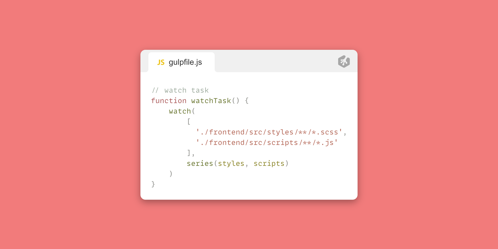

The last part of this gulpfile is exporting all of our functions. We will use the series method for this again. That snippet of code will look like this:

`exports.default = series(styles, scripts, watchTask);`

 

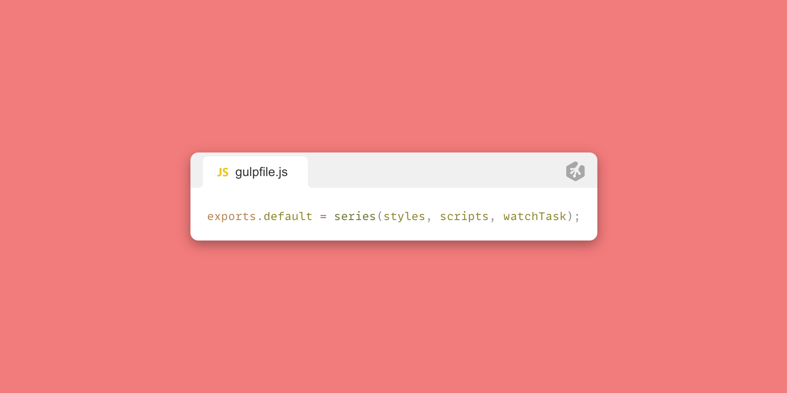

 
 

Here is a look at the full code incase something in your application isn't working and you need a reference:

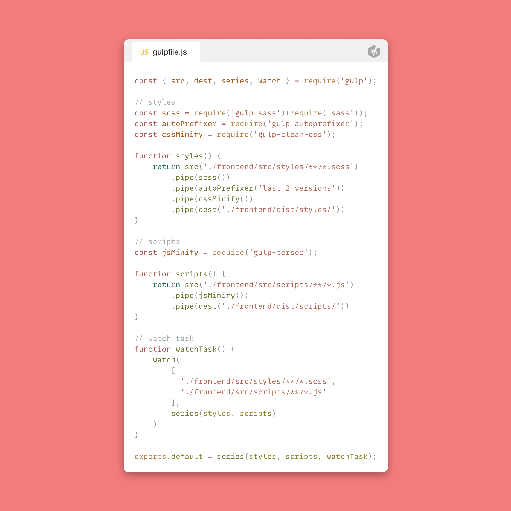

 
 

There we have it! You've written your first gulpfile! Feel free to checkout the gulp documentation for other helpful plugins like compressing images or even using babel. Now, let's see how we can run this gulpfile.

 
 

Go ahead and open up your **package.json** file. In there you'll see a "scripts" object with a "test" key. You can actually delete "test" and it's value. Instead, create a new property called "start". For the value, write "**npm install && gulp**". **npm install** will install all of your packages from your package.json's dependencies. (This is already done, but I like to keep this in my **start** command so that I install all my packages incase I am downloading this from a repo.) **gulp** will run your gulpfile.

Should look like this if done correctly:

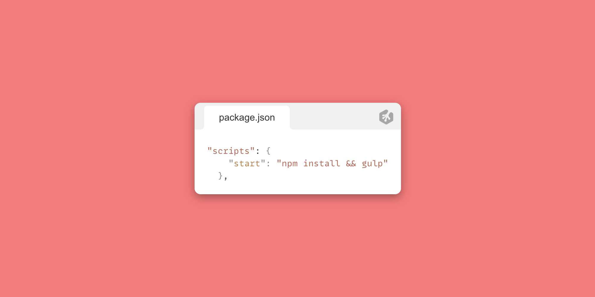

 
 

Next, we can open up our terminal and run `npm start`.

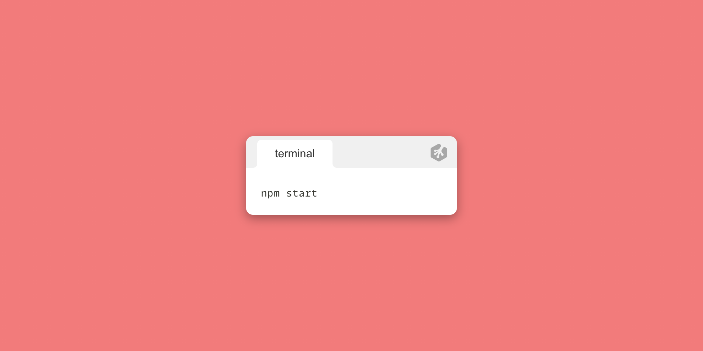

 

If all goes well, you should see an output very similar to this in your terminal:

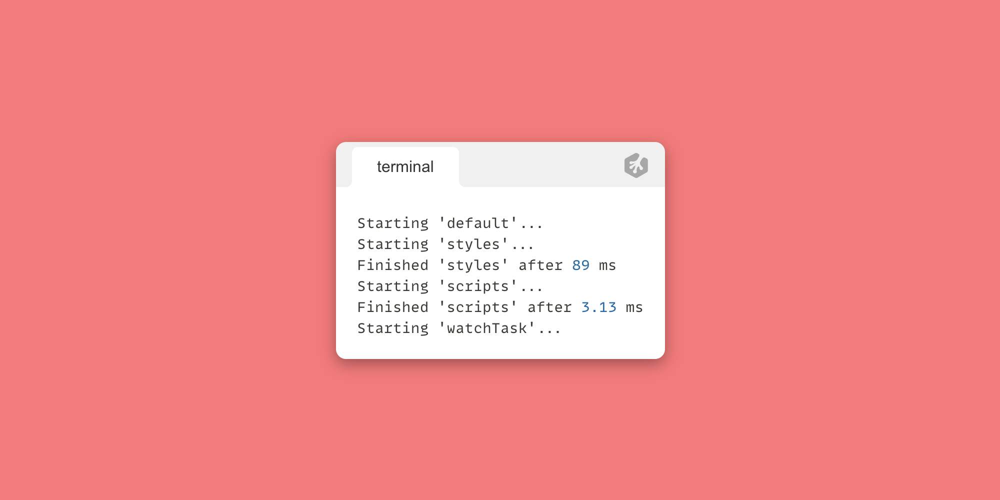

 
 
Woohoo! We now have a working gulpfile!
To see it in action, let's create an scss stylesheet in our src folder. 
inside `frontend/src/styles/` create a file `app.scss` for example. Then add some standard css like so:

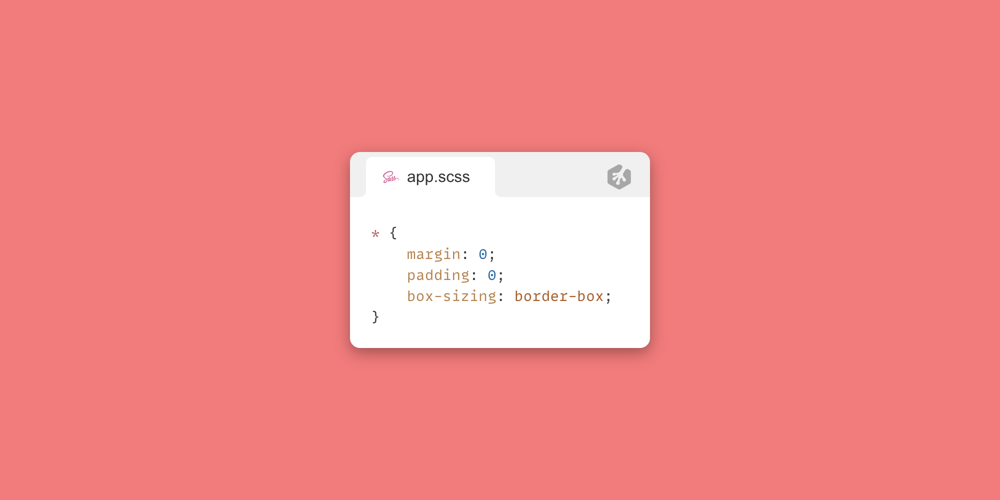

 

Hit save and then you should see a dist folder with a styles folder inside. Inside that styles folder you should see an **app.scss**\_\*\* file. The contents should have prefixers added to it and it should also be minified! Pretty cool, right?

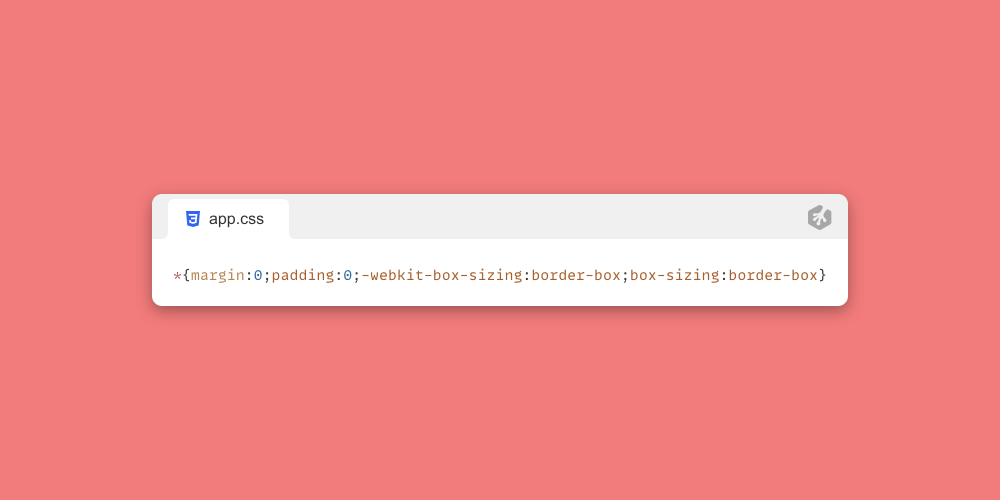

 

Now, lets give this a try with our scripts. Let's create a file named **app.js** inside of `/frontend/src/scripts/`.

We can write a simple JS object:

 

We should see it in `/frontend/dist/scripts/app.js`:

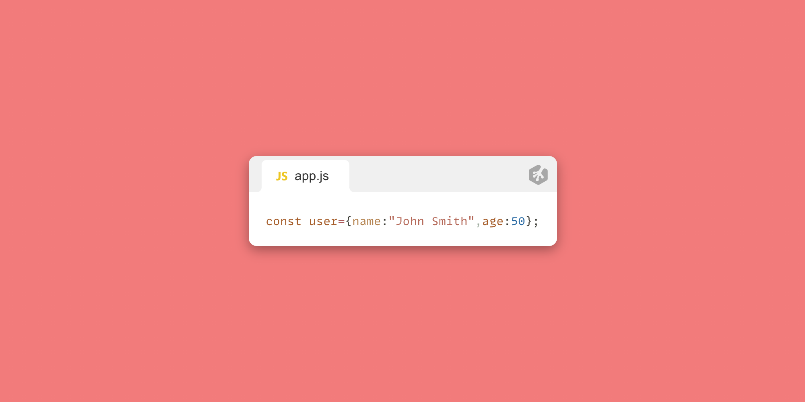

 
 

 
 

There you have it! A gulpfile that works to automate your workflow for you. This is a super simple gulpfile. How you craft your own personal gulpfile is completely up to you and what type of project you're building. Have fun with it and if you create something really neat, don't be shy! Share with the community via Slack 🙂
